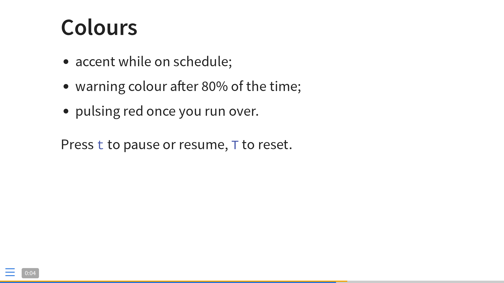

# qountdown

A time bar for Quarto RevealJS presentations.

RevealJS already draws a thin progress bar at the bottom of the screen, showing
how much of the deck you have shown. `qountdown` stacks a second bar of the same
height right on top of it, in a different accent colour, showing how much of
your allotted time you have used. Comparing the two tells you at a glance
whether you are ahead of or behind schedule.



The clock starts when the presentation goes full screen (`F`), so opening the
deck to check a slide does not eat into your time, and it goes back to zero and
stops when you leave full screen. An optional clock readout can be shown in any
of the four corners.

## Installation

Until not officially supported:

```bash
quarto add https://github.com/pbosetti/qountdown/archive/refs/heads/main.zip
```

When it will be officially available:

```bash
quarto add pbosetti/qountdown
```

This creates an `_extensions/qountdown` directory in your project; check it into
version control together with the rest of the project.

## Usage

Register the plugin and, optionally, configure it:

```yaml
---
title: "My talk"
format:
  revealjs:
    qountdown:
      minutes: 15
revealjs-plugins:
  - qountdown
---
```

`revealjs-plugins` is a top level option; everything under `qountdown` goes
under `format: revealjs:`. With no configuration at all the bar assumes a
20 minute slot.

## Options

All options live under `format: revealjs: qountdown:`.

| Option | Default | Meaning |
|---|---|---|
| `minutes` | `20` | Allocated time. Fractional values are allowed (`0.5` is 30 seconds). |
| `start` | `fullscreen` | When the clock starts: `fullscreen`, `immediate` (as soon as the deck loads), or `manual` (only via key or API). |
| `on-exit` | `reset` | What happens when you leave full screen: `reset` (back to zero and stopped, so the next full screen starts a fresh clock), `pause` (resume where you left off when you go back in), or `continue` (keep running). |
| `position` | `above` | Put the time bar `above` or `below` the progress bar. |
| `height` | progress bar height | Height in pixels, if you want it different from the progress bar. |
| `color` | `#f0a202` | Accent colour while on schedule. |
| `warning-color` | `#f25c05` | Accent colour past `warning-at`. |
| `overtime-color` | `#d7263d` | Accent colour once the time is up; the bar also pulses. |
| `track-color` | `rgba(0, 0, 0, 0.2)` | Colour of the unfilled part. |
| `warning-at` | `0.8` | Fraction of the allocated time at which the warning colour kicks in. |
| `label` | `false` | `true` shows the remaining time, `elapsed` shows the elapsed time instead. |
| `label-position` | `bl` | Corner for the clock: `bl`, `br`, `tr`, `tl` (`bottom-left` and friends also work). |
| `keys` | `{toggle: t, reset: T, set: M}` | Keyboard shortcuts, see below. Use `keys: false` to disable them. |

A fuller example:

```yaml
format:
  revealjs:
    qountdown:
      minutes: 12
      warning-at: 0.75
      color: "#4c9f70"
      label: true
      label-position: tr
      keys:
        toggle: p
        reset: P
        set: D
revealjs-plugins:
  - qountdown
```

## Keyboard

| Key | Action |
|---|---|
| `t` | Pause / resume the clock |
| `T` (shift + `t`) | Reset the clock to zero |
| `M` (shift + `m`) | Set a new duration: type the minutes, then `Enter` |

These do not interfere with RevealJS navigation, and are ignored while you are
typing in an input field. Change them with the `keys` option if they clash with
another extension (the `pointer` extension, for instance, uses `q` by default).

### Changing the duration during the talk

Slots move. Press `M` and a small box appears above the bars, in the spirit of
the RevealJS jump-to-slide box: type the new duration in whole minutes and
press `Enter`. `Esc`, or clicking away, cancels; the current allocation is shown
as a hint in the box while it is empty.

The elapsed time is left untouched, so the bar simply redraws against the new
allocation - if you are 10 minutes into a talk that just grew from 20 to 30
minutes, the bar drops back from two thirds to one third. The new duration
survives `T` and going in and out of full screen; reloading the deck goes back
to the value in the YAML.

## Scripting

The plugin exposes a small API, useful for a custom button or for reacting to
running over time:

```js
window.Qountdown.start();
window.Qountdown.pause();
window.Qountdown.toggle();
window.Qountdown.reset();      // back to zero, keeps running if it was running
window.Qountdown.stop();       // back to zero and idle
window.Qountdown.setMinutes(25);
window.Qountdown.promptMinutes(); // open the type-in box, as `M` does
window.Qountdown.getState();   // {state, elapsed, total} - times in ms

Reveal.on('qountdown-overtime', (e) => console.log('time is up', e.elapsed));
Reveal.on('qountdown-state', (e) => console.log(e.state, e.elapsed, e.total));
```

`Reveal.getPlugin('qountdown').api` gives the same object, per deck.

## Notes

- The bar is not rendered in `?print-pdf` view or when printing.
- Browser full screen entered with `F11` does not fire the standard full screen
  event; the plugin also treats a window that fills the whole screen as full
  screen, which covers `F11` and the macOS green button. Once the deck has been
  put in full screen with `F`, the full screen API becomes the authority, so
  that leaving it is noticed even on a screen sized window. If you present in a
  window, use `start: immediate` or press `t` to start the clock by hand.
- The clock keeps clear of the menu button, the slide number and the navigation
  arrows when it shares a corner with them.
- The bar only appears if the RevealJS progress bar is enabled (`progress: true`,
  the Quarto default). With `progress: false` the time bar sits at the very
  bottom of the screen on its own.

## Example

`example.qmd` in this repository is a small deck using the extension:

```bash
quarto render example.qmd
```


# Author

Paolo Bosetti, University of Trento
